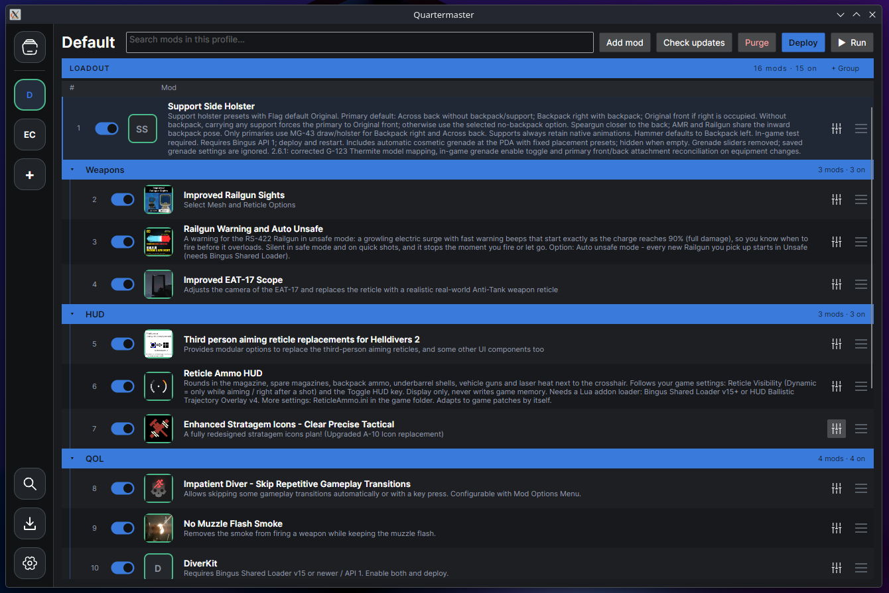

# Quartermaster



Quartermaster is a Helldivers 2 mod manager for organizing, updating, and deploying
mods. Search Nexus Mods from the app, track updates from Nexus Mods and GitHub,
and keep separate mod setups in profiles.

Disclaimer: This is actively in development and has yet to hit a stable v1.0 release. Expect the UI to change drastically, and features may be added or removed in subsequent versions.

- **Mod search:** browse Helldivers 2 Nexus Mods with thumbnails and open a
  result's download page from the app.

- **Mod updates:** check your library or a profile for updates, then install
  replacements without losing mod order, groups, or compatible option selections.

- **Profiles:** enable mods, select their options, organize them into collapsible
  groups, and drag them to change load order.

- **Repatching:** repair outdated unit formats during deployment while keeping
  the original mod files. Choose automatic repatching, confirmation, or disable it.

- **Profile sharing:** export a profile and its mods in one ZIP, or import someone
  else's setup.

## Installation

Download the latest archive for your operating system and architecture:

Choose a `bundled` archive to run without installing .NET. The smaller `runtime`
archives require the .NET 10 runtime. Builds are available for Linux, Windows,
and macOS on x64 and ARM64.

## Getting started

1. Open **Settings** and select your Helldivers 2 installation, or use
   **Find Steam installs**. Configure provider credentials here if you want
   search and online updates.

2. Open **Library** and choose **Add mod** to import a ZIP, folder, or Nexus Mods
   or GitHub link. You can also drag ZIPs and folders into the app.

3. Click **+** in the sidebar to create a profile. Right-click mods in Library
   and choose **Add to** to add them to it. Dropping a mod into a profile imports
   it and adds it to that profile.

4. Select the mods and options you want, then click **Deploy** and **Run**.

Changes to a profile take effect when you deploy it. The deployed profile is
marked green; yellow mod outlines indicate a difference from what is deployed.

Use **Purge** to remove any deployed patches and have a vanilla game.

Right-click a profile to rename, duplicate, delete, or export it. Import a profile
ZIP through the create-profile dialog or by dropping it into the sidebar.

## Search and updates

Use **Search** to find Helldivers 2 mods on Nexus Mods. Choose **Open download
page** to start an import. Quartermaster opens your browser and watches your
configured download folder; once the ZIP finishes downloading, it imports the mod.

**Check updates** in Library checks all tracked mods. In a profile, it checks
that profile's mods. Mods with an available update show an **Update** button.

GitHub release ZIPs download directly; Nexus Mods updates use your browser.

Updated mods keep their place in your profiles. After updates, you must redeploy.

The **Downloads** page shows pending and failed requests. You can attach a ZIP
manually if you already have it or download recognition misses it, retry a failed
request, or cancel it.

For mods without provider tracking, set a **Mod page** link in mod details.
You can also enter the page URL in the confirmation dialog when importing a local
ZIP or folder, including drag-and-drop imports.
**Check updates** opens a **Manual checks** list for these mods in Downloads.
Open a page to check for a newer ZIP; Quartermaster matches new downloads by name
and version, using token and fuzzy similarity for differing names. When versions
cannot be compared, a strong name match needs a newer creation or modification
timestamp. Parenthesized numbers such as `(2)` are not versions. Existing downloads
are ignored. Apparently lower versions show a warning with an **Import anyway**
option; uncertain matches need an explicit **Attach ZIP**. Updates keep the
mod's position, group, and compatible options in profiles. **Mark checked** ends
the watch when there is no update. Downloaded ZIPs remain in your browser's folder.

## Provider credentials

Configure credentials in **Settings**, then click **Save**.

- **Nexus Mods:** a personal API key is required for search, update checks, and
  browser download verification. Get it from Nexus account settings → API.

  Free accounts can use the browser download flow; you still click the download
  button on Nexus Mods. (Eventually this will use the official nexus integration, and this step will be unneeded)

- **GitHub:** a personal access token is optional and increases the API rate
  limit. Create one under Settings → Developer settings → Personal access tokens.

## Your mod files

Quartermaster keeps imported originals in its own library and repatches during
deployment. **Export repatched ZIP** in a mod's Library context menu saves a
repaired copy separately. Repatching is experimental, expect some failures.

Profile exports include mod files, load order, groups, and option selections.

Provider credentials are stored separately and are excluded from exports.

Application data is stored under `Quartermaster` in your user's local application
data directory. Its location is shown in Settings. Set
`QUARTERMASTER_DATA_DIRECTORY` to use another location.

## Development

Quartermaster is written in C# with Avalonia and uses a C# port of hd2_repatcher.

To run from source, install the .NET 10 SDK:

```bash
dotnet run --project src/Quartermaster.Gui
```

With [just](https://github.com/casey/just):

```bash
just build
just test
just lint
just package linux-x64
```

See the [repatcher documentation](src/Quartermaster.Repatcher/README.md) for
patching details and the [changelog](CHANGELOG.md) for release changes.

## License

[MIT](LICENSE)
